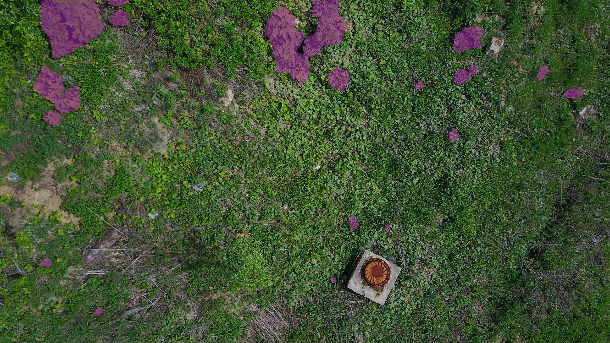

# Heracleum Dataset

Dataset of aerial images of hogweed gathered in Moscow Region.

## Data Description

This dataset contains 263 aerial images of hogweed, obtained in Moscow Region. Images are captured with DJI Phantom 3 drone, DJI Mavic Pro drone, and Xiaomi Yi action camera. Images can be split into 3 groups by the number of instances on them:

| Device  | DJI Phantom 3 | DJI Mavic Pro | Xiaomi Yi action camera | Total |
| --- | --- | --- | --- | --- |
| Without objets  | 3 | 15 | 0 | 18 | 
| Separate objects | 31 | 30 | 24 | 85 |
| Many objects | 58 | 57 | 45 | 160 |

## Mask Description

Each image has a mask for the image segmentation task. In place of hogweed, this mask has 1 and 0 otherwise.

Image with mask 

## Links

Google Drive: [link](https://drive.google.com/open?id=1SlnazXTTtB3KA9u9opCA8AsF_f1U26Gp)
